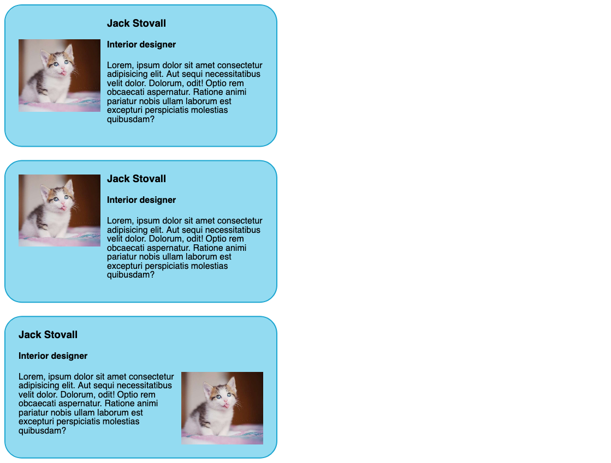

# Media object

Create three media object elements like in the picture below and pay attention to how picture and content are aligned differently in each one of them.

`Important: rely only on Flexbox and don't use float, display: inline-block or position.`

